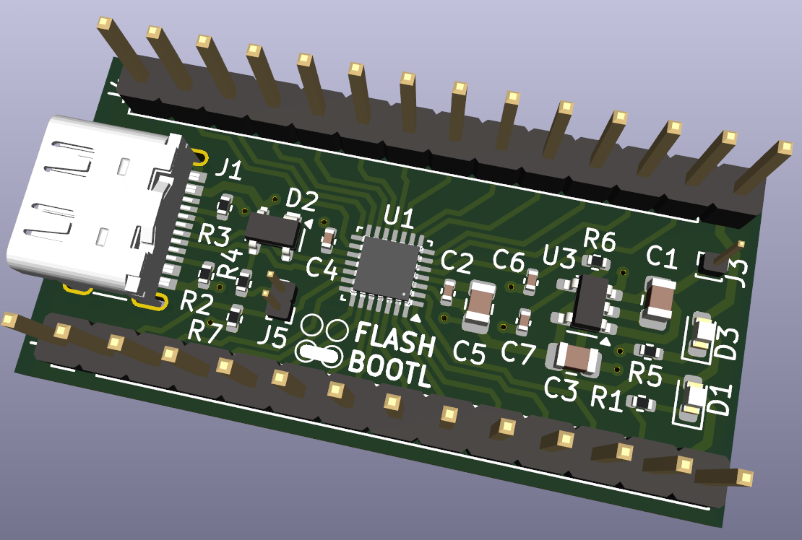
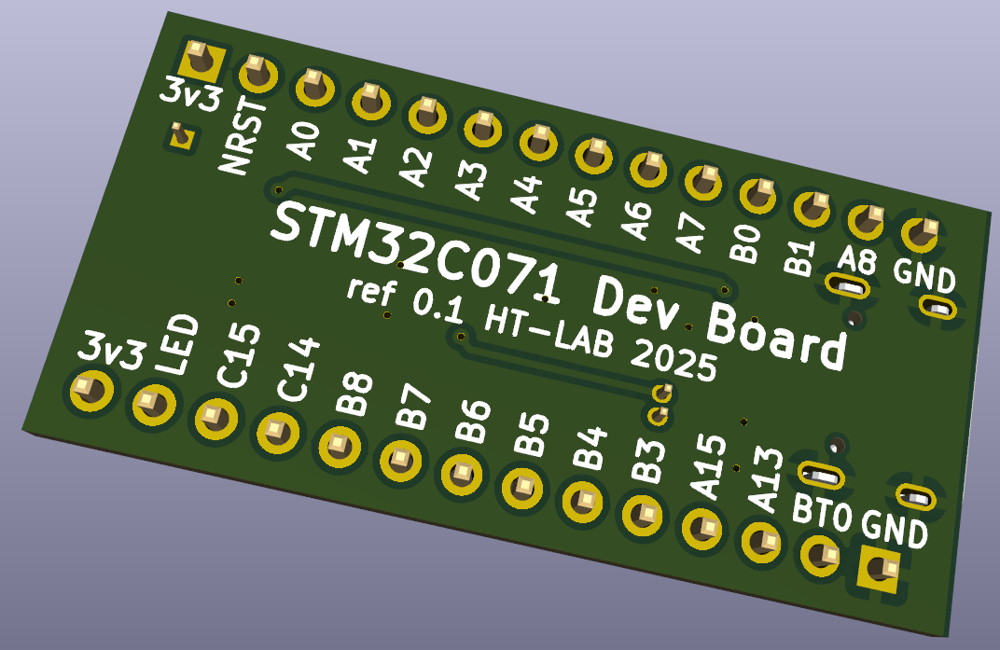

# STM32C071G8 Development Board
This repository contains a tiny STM32C071G8U6N development board developed in [KiCAD8](https://www.kicad.org/). The board took just 1 day to develop and another few hours sorting out some [JLCPCB](https://jlcpcb.com/) issues (wrong/shifted part alignments, selecting parts from [LCSC](https://www.lcsc.com/) etc). 

**Note this board has not yet been manufacturered (JLCPCB gave a quote for £47{UK} for 5 Boards).**

The boards is nothing more but a USB-C connector, STM32C071 and a 3.3v power regulator. Schematics/PBC/Manufacturing data is located in the KiCAD directory.

  

  

## License

See the LICENSE file for details.

## Trademarks

STM32 is a registered trademark of STMicroelectronics International N.V.